# Omahart Florist

Website UMKM florist dan souvenir berbasis Laravel untuk membantu digitalisasi usaha lokal.

## Features

* Dynamic product catalog
* Product category system
* Product detail page
* Search feature
* Admin dashboard
* Admin authentication
* Responsive modern UI

## Technologies Used

* Laravel
* PHP
* MySQL
* TailwindCSS
* JavaScript
* Vite

## My Role

Project Coordinator & Fullstack Developer

Bertanggung jawab dalam pengembangan frontend dan backend website, termasuk:

* UI Implementation
* Database Integration
* Authentication System
* Dashboard Admin
* Product Management

## Installation

composer install
cp .env.example .env
php artisan key:generate
php artisan serve

## Database

Import file:

* omahart-floristt.sql

## Screenshots

### Homepage

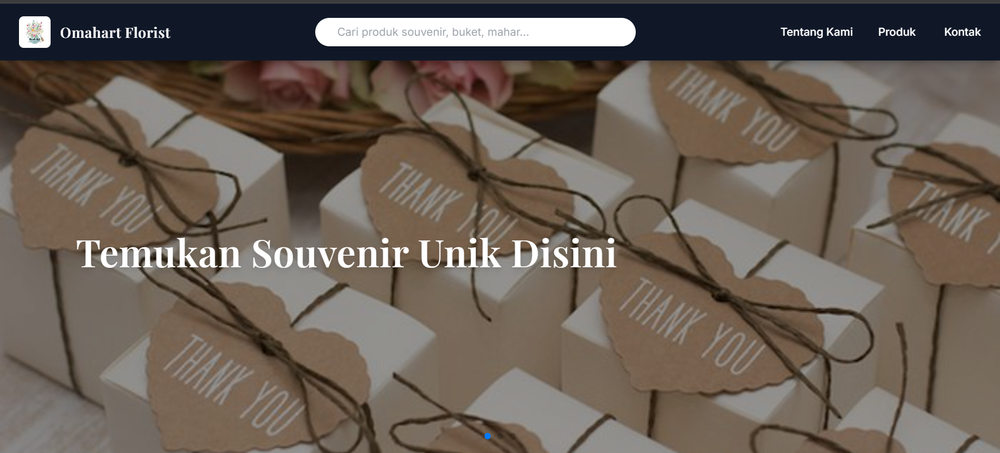

### Produk

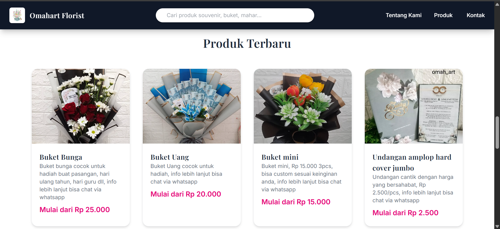

### Kategori

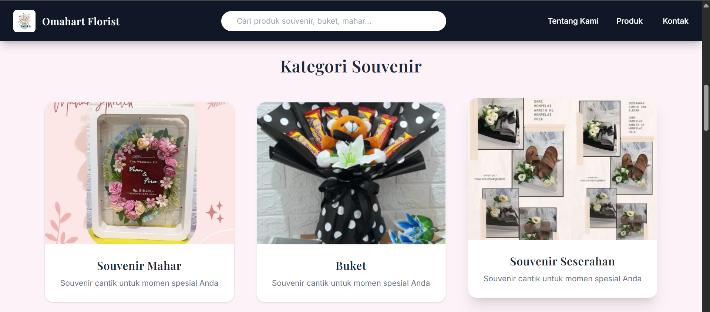

### Detail Produk 1

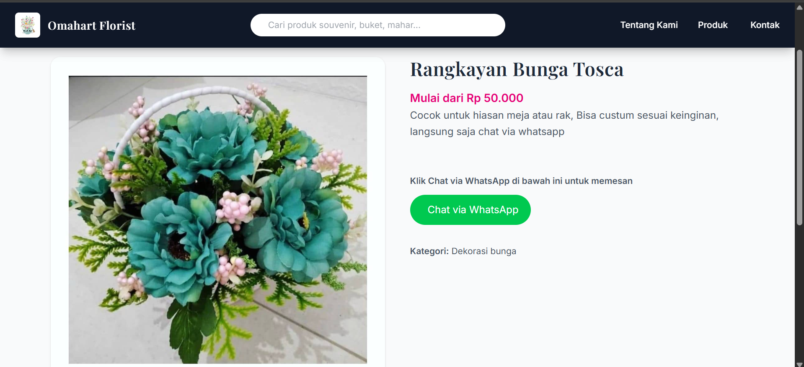

### Detail Produk 2

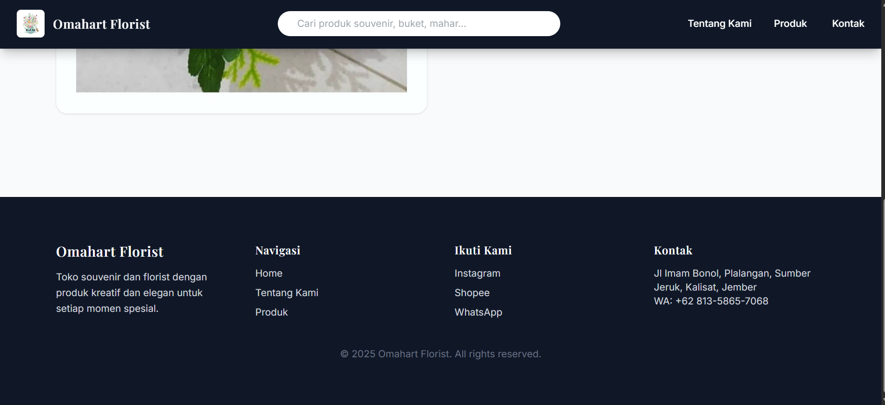

### Kontak 1

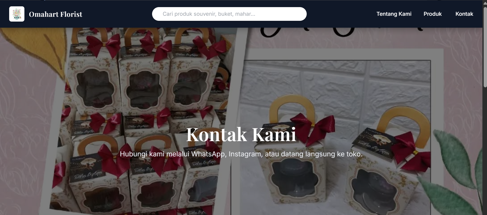

### Kontak 2

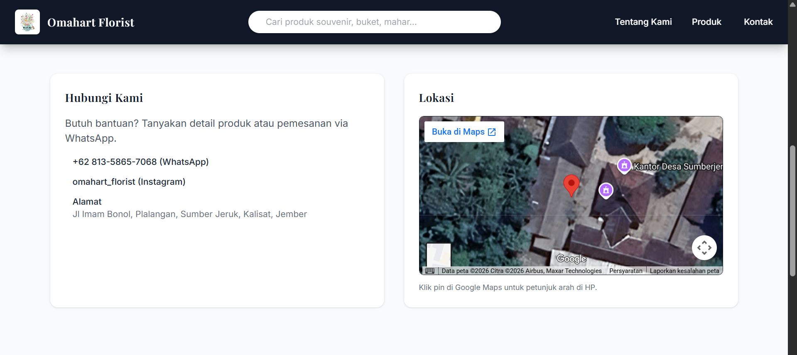

### Tentang Kami 1

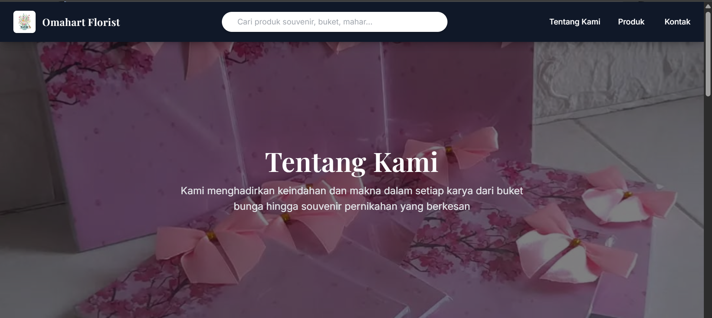

### Tentang Kami 2

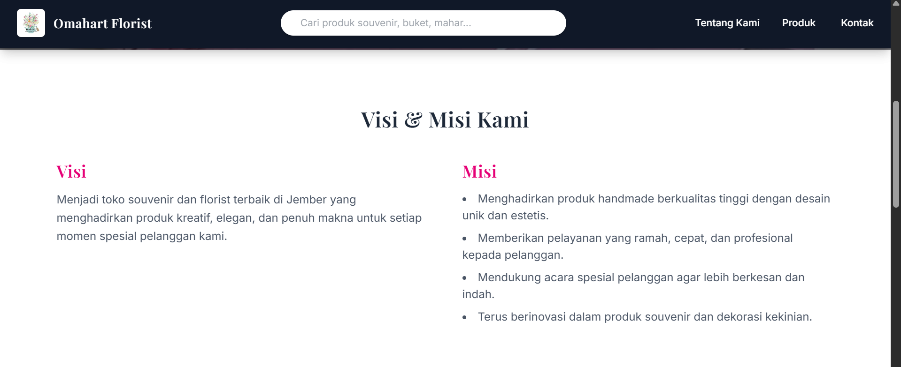

### Tentang Kami 3

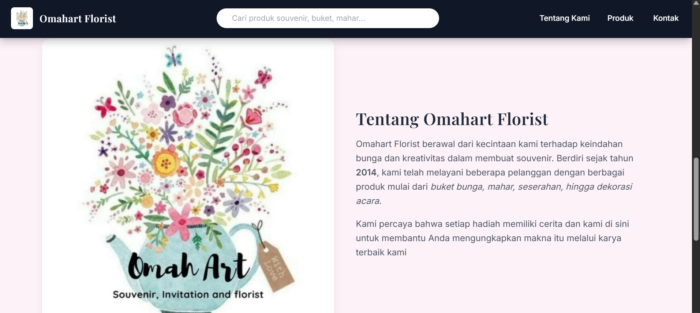

---

## Dashboard Admin

### Dashboard Utama

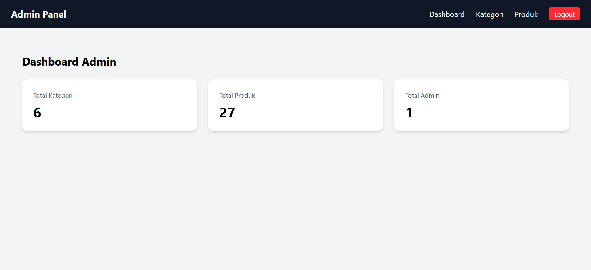

### Dashboard Kategori

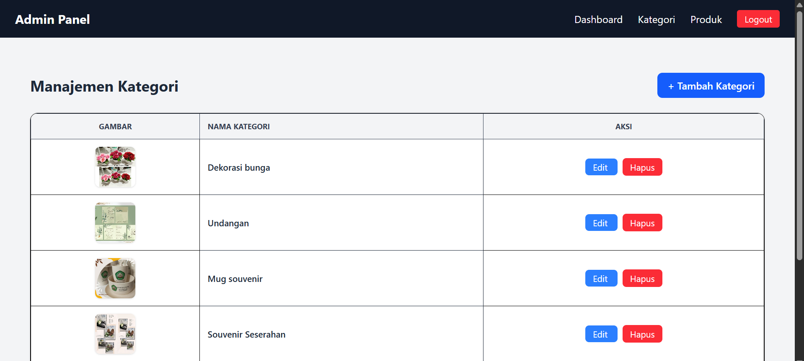

### Dashboard Produk

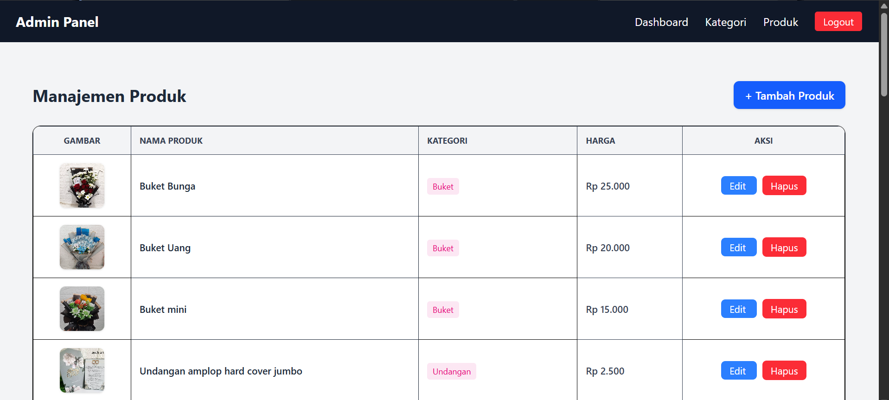

### Edit Kategori

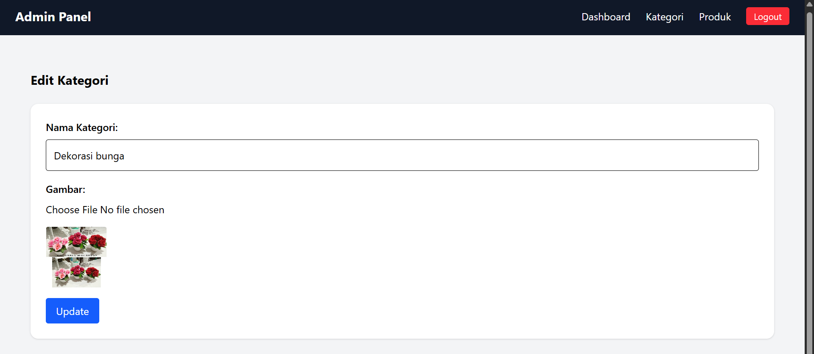

### Edit Produk 1

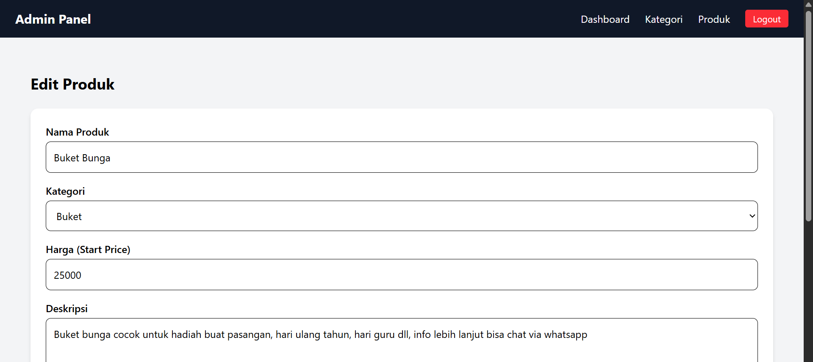

### Edit Produk 2

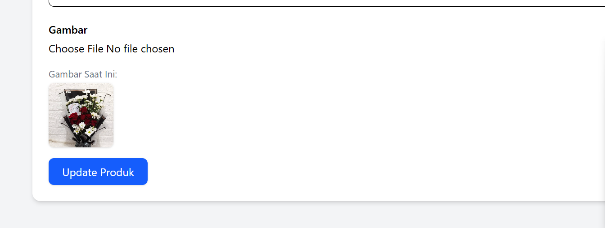

---

## Login Admin

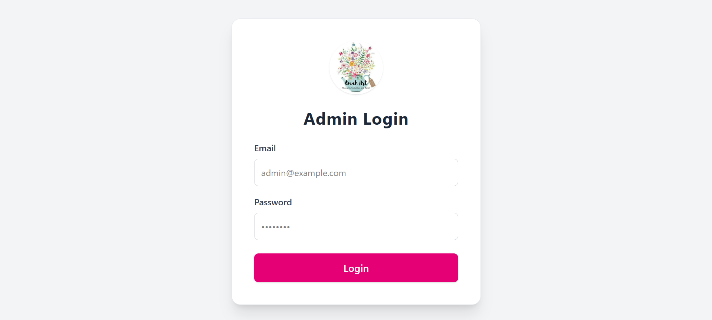

## Author

Muhammad Fauzan Aly Ridlo
